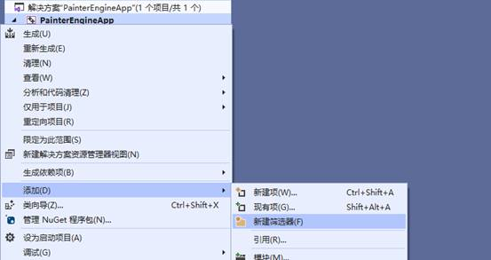
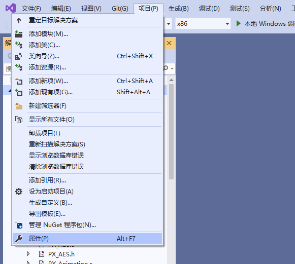
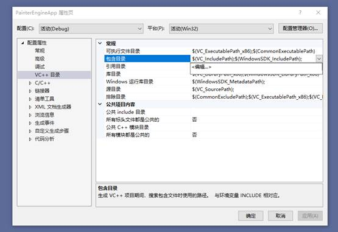

# 快速上手

## Windows

- 下载解压 PainterEngine

  

- 使用 Visual Studio 创建一个空项目

- 新建一个筛选器，命名为 PainterEngine(本步骤非必须)

  

- 将 PainterEngine 以下三个文件夹拖到项目文件夹中

  

- 将`platform/windows`文件夹拖到项目文件夹中

  

- 在菜单中点击项目=>属性

  

  

- 选中 VC++目录=>包含目录=>编辑

  

- 将`Painterengine`、`Painterengine/project`两个文件夹位置加入包含目录

  

- 编译、运行

  

## Ubuntu

## MacOS

## Android

## IOS
