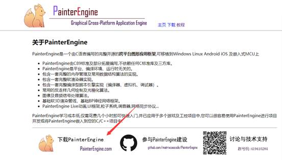
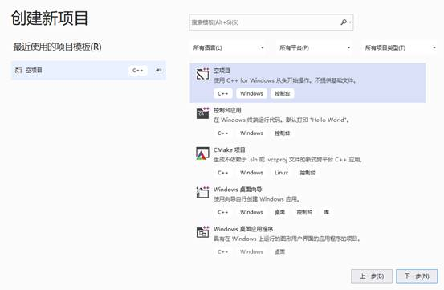
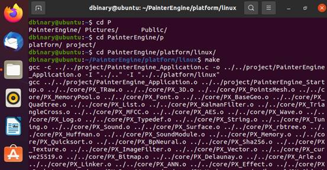
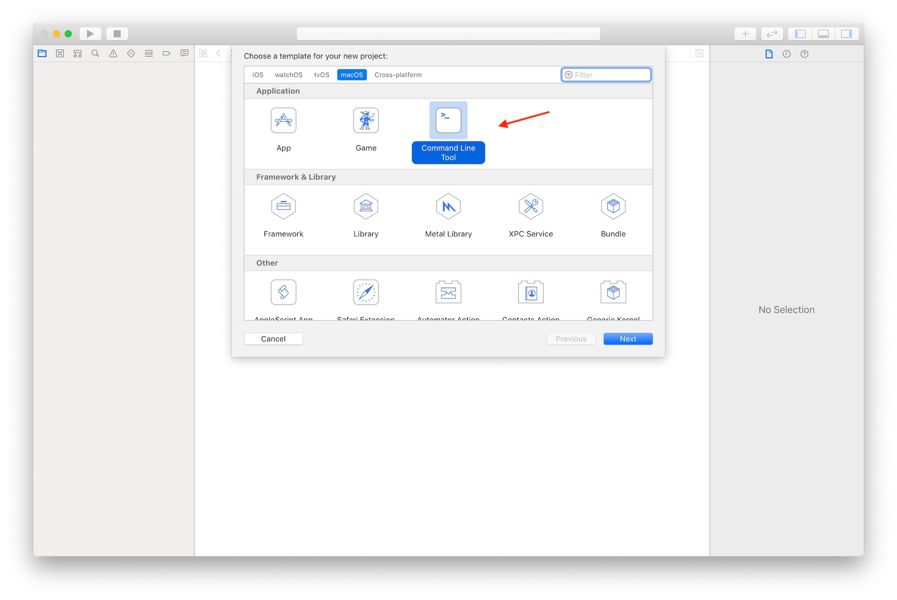
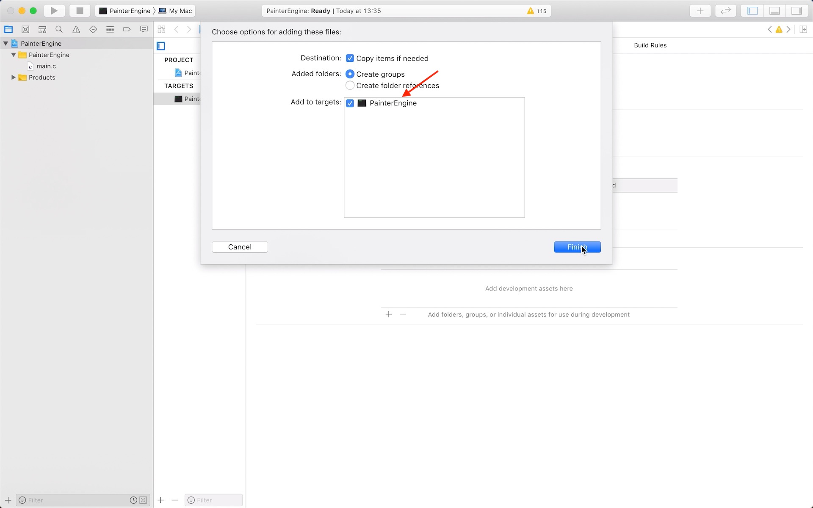
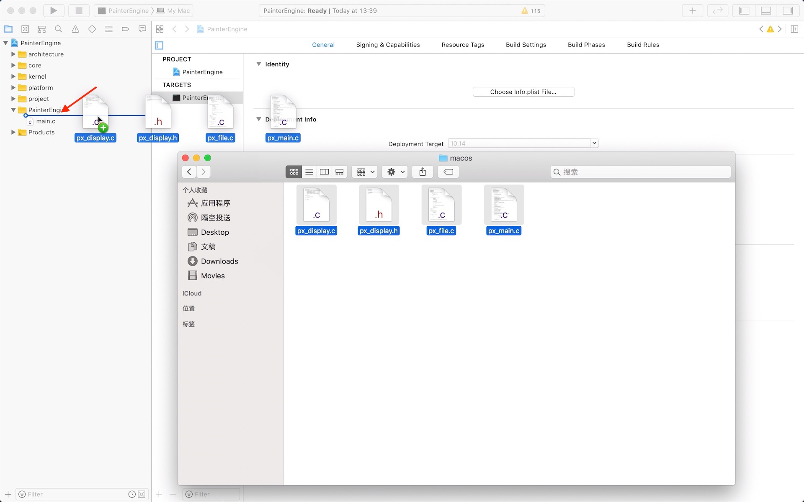
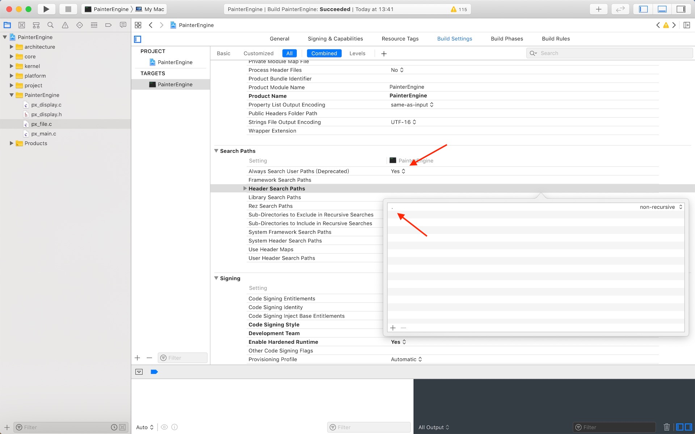

# 快速上手

## Windows

- 下载解压 PainterEngine

  

- 使用 Visual Studio 创建一个空项目

  

- 新建一个筛选器，命名为 PainterEngine(本步骤非必须)

  

- 将 PainterEngine 以下三个文件夹拖到项目文件夹中

  

- 将`platform/windows`文件夹拖到项目文件夹中

  

- 在菜单中点击项目=>属性

  

  

- 选中 VC++目录=>包含目录=>编辑

  

- 将`Painterengine`、`Painterengine/project`两个文件夹位置加入包含目录

  

- 编译、运行

  

## Ubuntu

- 下载解压，进入`PainterEngine/platform/linux`，执行 make
  

## MacOS

使用 Xcode 编译 PainterEngine

- 访问 www.painterengine.com,在左下角点击下载 PainterEngine
  

- 解压缩 PainterEngine 压缩包

- 启动 Xcode 创建一个 Command Line Tool 新项目，Language 选择 C
  
- 将 PainterEngine 以下五个文件夹拖到项目文件夹中
  
  
- 删除 platform 文件夹中的平台相关文件夹
  
  
- 将 platform/macos 以下文件拖到项目对应文件夹中
  
  
- Xcode project Build Setting

  `Search Paths` Always Search User Paths (Deprecated) 设置为 Yes，Header Search Paths 添加当前项目路径.

  `Apple Clang - Preprocessing` Preprocessor Macros 添加 宏定义`GL_SILENCE_DEPRECATION`

  
  
  

- 修改 px_file.c 头文件路径

```c
#include "platform/modules/px_file.h"
```

现在,你可以编译运行 Painterengine 程序了

