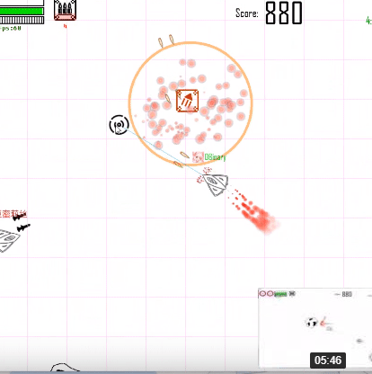
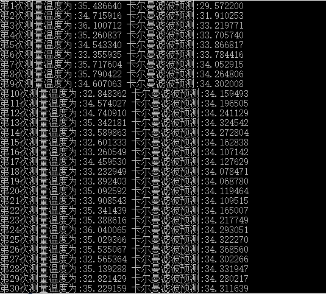

# 样品展示

## 3D bunny

使用 PainterEngine 3D 管线渲染的一个带有简单光照的斯坦福兔子。
[示例程序及源代码](http://painterengine.com/main/instances/instance2021051301/project.zip)

## 星际老司机

使用 PainterEngine 开发的多人在线对战网游。

包含一个游戏实例服务端/客户端，游戏大厅服务端/客户端[源代码](https://github.com/matrixcascade/PainterEngine-Game)

\*与当前版本 PainterEngine 存在兼容问题

## 卡尔曼滤波

使用 PainterEngine KalmanFilter 开发的温度预测实例[下载](http://painterengine.com/main/instances/instance2021051401/project.zip)

